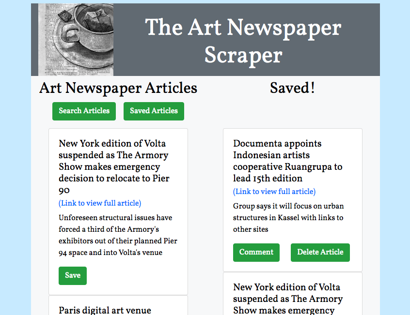
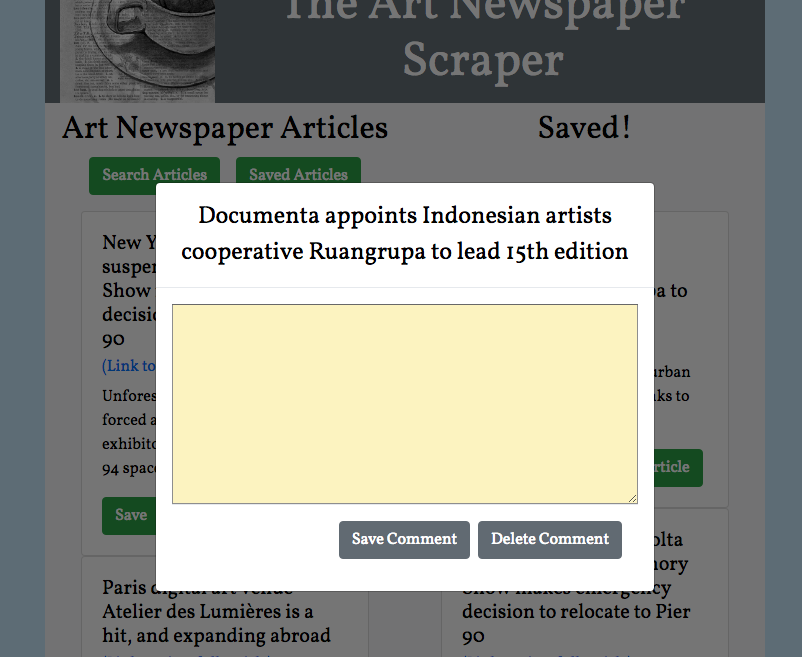

# [artScrape](https://alejosjen.github.io/artScrape/)

**Project Description**

Sip a cup of tea while searching for the latest news articles from "The Art Newspaper". 

*The front page*

*Area for comments*

[View the site on Heroku.](https://thawing-forest-50146.herokuapp.com/)

**To USE:**

Click "Search Articles" to retrieve the latest news of the day. Click the link to see the full article on "The Art Newspaper" website. Save any articles you find interesting. When you click "Saved Articles" you're saved articles will appear. In this section you can comment and save your thoughts or inspiration from your reading.

**To BUILD:**

Find your favorite news site that you can scrape. Try to figure out the tags and elements you can grab and use Cheerio to help. Then set up your database to store the information. The database I used is MongoDB in combination with Mongoose and Robo3T to help sort and join information like comments to articles. Set up your routes to filter your searches and set up your ajax calls with axios to match the api calls. Set up the HTML areas where you'd like the information to go and then style it up. I used express-handlebars to serve the HTML pages and modals to display the comment sections to an article.

**Project Specifications**

Front End - HTML with Bootstrap, Javascript, jQuery, CSS, modal

Backend - Node.js, MongoDB, mongoose, Robo3T, deployed by Heroku

Installed packages: axios, cheerio, express, express-handlebars, mongoose, morgan

Jennifer Alejos [https://www.jenalejos.com/](https://www.jenalejos.com/)